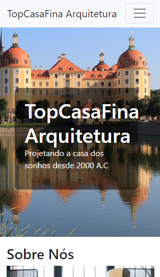

# Experiment Lab 🧪

## Objective

<i> * Creation of an architecture company page! </i>

## Reference

<i> * The basis of the project was created from the inspiration of the Bootstrap: Single Page Application course content at Alura </i>

## Features

<i> * Bootstrap -> Responsiveness of the elements</i>

<i> * CSS -> Stylization of elements </i>

<i> * HTML -> Hypertext Markup Language </i>

## Get started

<i> * Open: <b>index.html (located in the src folder)</b></i>

## Application

